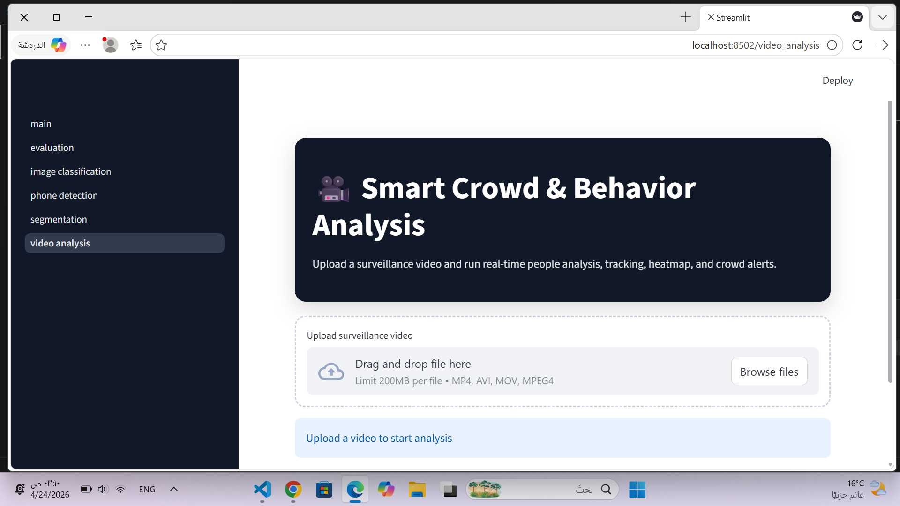
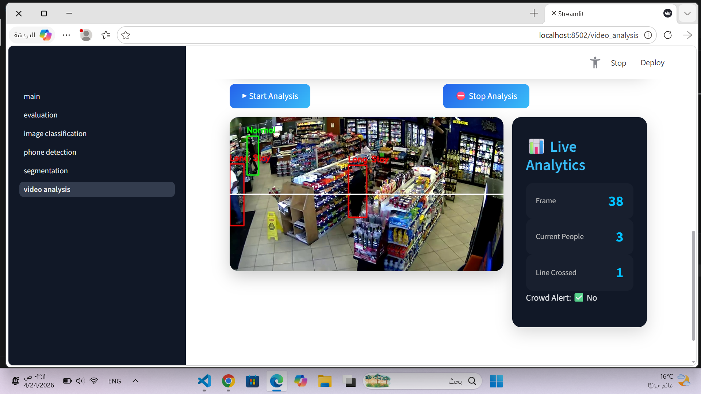
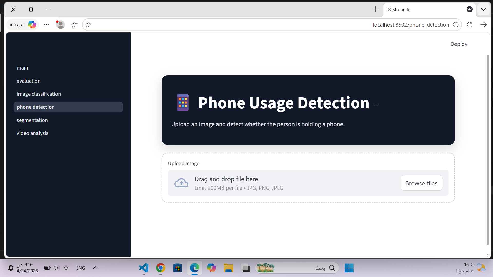
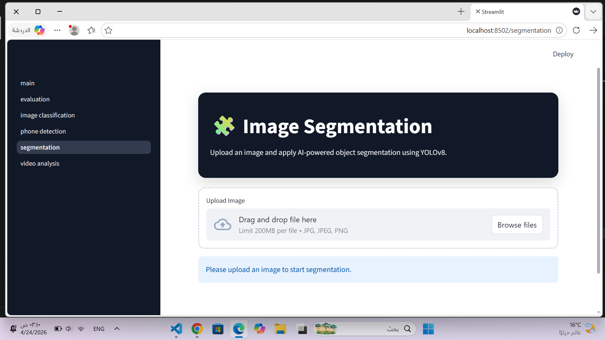
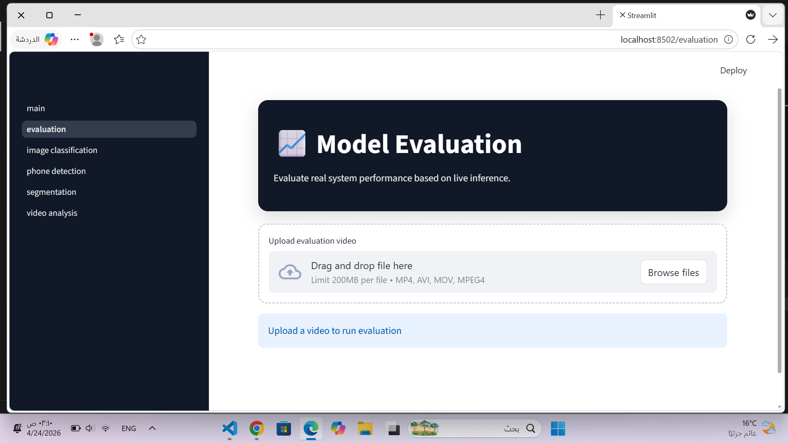
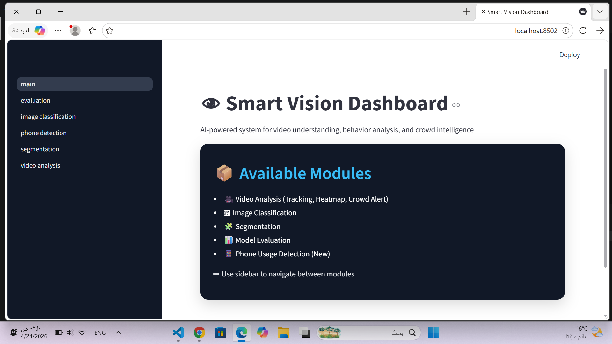

# 🚀 Smart Vision Dashboard (AI Multi-Tool)

An advanced AI-powered system built using **YOLOv8** for real-time video and image analysis, focusing on human behavior understanding and smart visual analytics, with an interactive interface powered by **Streamlit**.

---

## 📸 Project Gallery

### 📽️ Video Analysis Pipeline

| Waiting State | Live Analysis |
| :---: | :---: |
|  |  |

---

### 🧩 Core Modules

| 📱 Phone Detection | 🧩 Segmentation | 📊 Evaluation |
| :---: | :---: | :---: |
|  |  |  |

---

| 🖼️ Classification | 🏠 Dashboard |
| :---: | :---: |
|  |  |

---

## ✨ Key Features

- **Real-time Crowd Analysis:** Detect and track people, including boundary crossing behavior  
- **Phone Usage Detection:** Custom-trained model to detect mobile phone usage  
- **Instance Segmentation:** Pixel-level object separation using deep learning  
- **Model Evaluation Dashboard:** Visual performance metrics for each model  

---

## 🛠️ Tech Stack

- **Deep Learning:** YOLOv8 (Ultralytics)  
- **Framework:** PyTorch  
- **Interface:** Streamlit + Custom UI  
- **Libraries:** OpenCV, PIL, Pandas  

---

## 📊 Dataset

> ⚠️ The dataset used for training and testing is not included in this repository due to size limitations.  
> You can use any similar dataset or your own custom data.

---

## 🚀 How to Run

```bash
pip install -r requirements.txt
streamlit run app.py
👩‍💻 Author

Abeer Aun

⭐ Notes

This project demonstrates practical applications of Computer Vision and Deep Learning in real-world scenarios.
